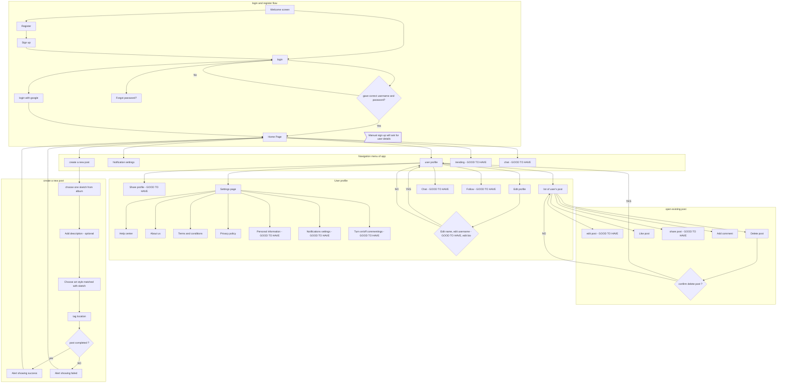

```mermaid
    flowchart TD
        subgraph login and register flow
        A[Welcome screen] --> B[login]
        A[Welcome screen] --> C[Register]
        B --> B1{gave correct username and password?}
        B1 -- Yes --> E[Home Page]
        B --> F[Forgot password?]
        B1 -- No --> B
        B --> B2[login with google]
        B2 --> E
        C --> C2[Sign up] 
            id1>Manual sign up will ask for user details]
        C2 --> B
        end

        subgraph Navigation menu of app
        E --> G[user profile]
        E --> H[Notfication settings]
        E --> I[create a new post]
        E --> J[trending - GOOD TO HAVE]
        E --> K[chat - GOOD TO HAVE]
        end

        subgraph User profile
        G --> G1[Share profile - GOOD TO HAVE]
        G --> G2[Settings page]
        G --> G4[list of user's post]
        G --> G3[Edit profile]
        G --> G5[Chat - GOOD TO HAVE]
        G --> G6[Follow - GOOD TO HAVE]
        G2 --> G21[Help center]
        G2 --> G22[About us]
        G2 --> G23[Terms and conditions]
        G2 --> G24[Privacy policy]
        G2 --> G25[Personal information - GOOD TO HAVE]
        G2 --> G26[Notifications settings - GOOD TO HAVE]
        G2 --> G27[Turn on/off commentings - GOOD TO HAVE]
        G3 --> G31{Edit name, edit username - GOOD TO HAVE, edit bio}
        G31 -- YES --> G
        G31 -- NO --> G
        end

        subgraph open existing post
        G4 --> G41[edit post - GOOD TO HAVE]
        G4 --> G42[Delete post]
        G4 --> G43[Like post]
        G4 --> G44[share post - GOOD TO HAVE]
        G4 --> G45[Add comment]
        G42 --> G421{confirm delete post ?}
        G421 -- YES --> G
        G421 -- NO --> G4
        end

        subgraph create a new post
        I --> I1[choose one sketch from album]
        I1 --> I2[Add description - optional]
        I2 --> I3[Choose art style matched with sketch]
        I3 --> I4[tag location]
        I4 --> I5{ post completed ?}
        I5 -- yes --> I6[Alert showing success]
        I6 --> E
        I5 -- NO --> I7[Alert showing failed]
        I7 --> E
        
        end

```
