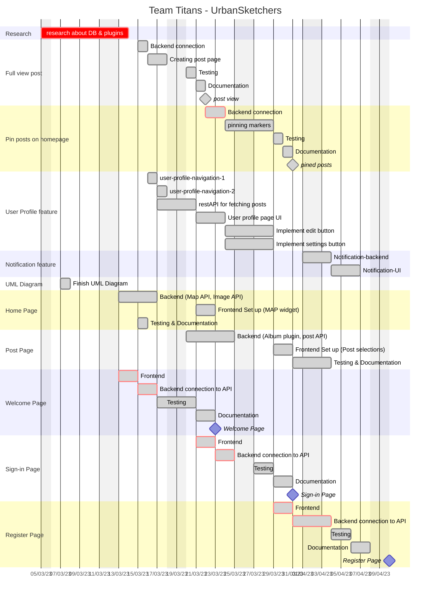

```mermaid
gantt
    title Team Titans - UrbanSketchers
    dateFormat YYYY-MM-DD
    axisFormat %d/%m/%y
    excludes    weekends
    todayMarker on
    
    section Research
        research about DB & plugins: crit, 2023-03-05, 7d

    section Full view post
        Backend connection        : done, backend1, 2023-03-15, 1d
        Creating post page        : done, postPage, after backend1, 2d
        Testing                   : done, test, after postPage, 1d
        Documentation             : done, documentation, after test, 1d

    post view: done, milestone, after documentation, 2mins
    %% Pin posts should ideally start after homepage is created
    %% for now I'm scheduling to start after Post View

    section Pin posts on homepage
        Backend connection        : done, crit, backend2, after documentation, 2d
        pinning markers           : done, pinning, after backend2, 3d
        Testing                   : done, testing, after pinning, 1d
        Documentation             : done, doc    , after testing, 0.5d 
    
    pined posts: done, milestone, after doc, 2mins    

    section User Profile feature
        %% As a user, On clicking user profile icon on navigation menu, my User profile page should open
        user-profile-navigation-1 : done, userprofile-task-1, 2023-03-16, 1d
        %% On clicking profile picture of any user in app, that person's User profile page should open
        user-profile-navigation-2 : done, user-profile-navigation, after userprofile-task-1, 1d
        %% [backend] fetch all posts information related to user's profile including unit testing
        restAPI for fetching posts : done, fetch-all-posts, after userprofile-task-1, 2d
        %% Implement UI of user profile including widget testing 
        User profile page UI : done, User-profile-UI, after fetch-all-posts, 3d
        Implement edit button: done, edit-profile, after User-profile-UI, 3d
        Implement settings button: done, settings-profile, after User-profile-UI, 3d

    section Notification feature
        %% As a user, I should be able fetch all notifications including unit testing
        Notification-backend: done, notification-backend, 2023-04-01, 2d
        %% As a user, I should be able see all notifications including widget testing
        Notification-UI : done, notification-UI, after notification-backend, 3d

    section UML Diagram 
        Finish UML Diagram                  :done, r1, 2023-03-07, 1d

    section Home Page
        Backend (Map API, Image API)        :done, t1, 2023-03-13, 4d
        Frontend Set up (MAP widget)        :done, f1, after t1, 2d
        Testing & Documentation             :done, after f1, 1d

    section Post Page
        Backend (Album plugin, post API)    :done, t2, 2023-03-20, 5d
        Frontend Set up (Post selections)   :done, t21, after t2, 2d
        Testing & Documentation             :done, t22, after t21, 2d

    section Welcome Page
        Frontend                            :done, crit, f1, 2023-03-13, 2d
        Backend connection to API           :done, crit, b1, after f1, 2d
        Testing                             :done, t1, after b1, 2d
        Documentation                       :done, d1, after t1, 2d

    Welcome Page: milestone, after d1, 2mins

    section Sign-in Page
        Frontend                            :done, crit, f2, 2023-03-21, 2d
        Backend connection to API           :done, crit, b2, after f2, 2d
        Testing                             :done, t2, after b2, 2d
        Documentation                       :done, d2, after t2, 2d

    Sign-in Page: milestone, after d2, 2mins

    section Register Page
        Frontend                            :done, crit, f3, 2023-03-29, 2d
        Backend connection to API           :done, crit, b3, after f3, 2d
        Testing                             :done, t3, after b3, 2d
        Documentation                       :done, d3, after t3, 2d

    Register Page: milestone, after d3, 2mins
``` 
