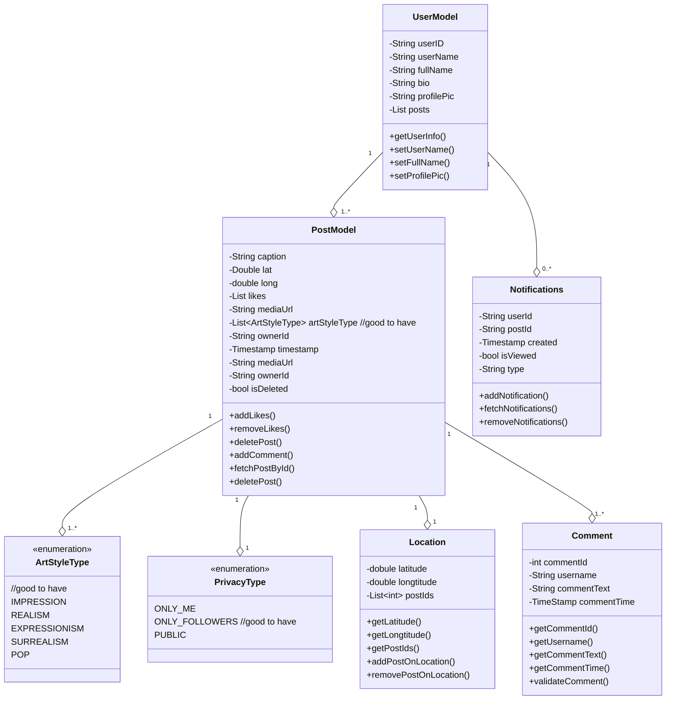

```mermaid
classDiagram
    PostModel "1" --o "1..*" ArtStyleType
    PostModel "1" --o "1" PrivacyType
    PostModel "1" --o "1" Location 
    PostModel "1" --o "1..*" Comment
    UserModel "1" --o "1..*" PostModel 
    UserModel "1" --o "0..*" Notifications 
    
    class Notifications {
        -String userId
        -String postId
        -Timestamp created
        -bool isViewed
        -String type
        +addNotification()
        +fetchNotifications()
        +removeNotifications()
    }

    class UserModel {
        -String userID
        -String userName
        -String fullName
        -String bio
        -String profilePic
        -List<PostModel> posts
        +getUserInfo()
        +setUserName()
        +setFullName()
        +setProfilePic()
    }

    class Location {
        -dobule latitude
        -double longtitude
        -List~int~ postIds
        +getLatitude()
        +getLongtitude()
        +getPostIds()
        +addPostOnLocation()
        +removePostOnLocation()
    }
    class PrivacyType {
        <<enumeration>>
        ONLY_ME
        ONLY_FOLLOWERS //good to have
        PUBLIC
    }

    class ArtStyleType { //good to have
        <<enumeration>>
        IMPRESSION
        REALISM
        EXPRESSIONISM
        SURREALISM
        POP
    }

    class PostModel {
        -String caption
        -Double lat
        -double long
        -List<dynamic> likes
        -String mediaUrl
        -List~ArtStyleType~ artStyleType //good to have
        -String ownerId
        -Timestamp timestamp
        -String mediaUrl
        -String ownerId
        -bool isDeleted
        +addLikes()
        +removeLikes()
        +deletePost()
        +addComment()
        +fetchPostById()
        +deletePost()
    }

    class Comment {
        -int commentId
        -String username
        -String commentText
        -TimeStamp commentTime
        +getCommentId()
        +getUsername()
        +getCommentText()
        +getCommentTime()
        +validateComment()
    }

```
